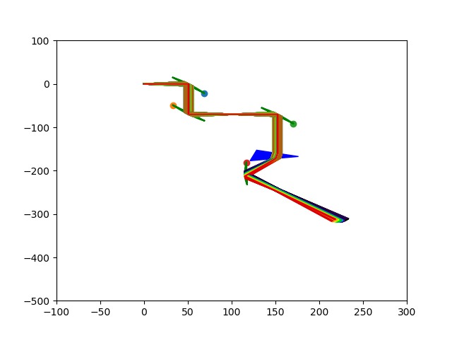
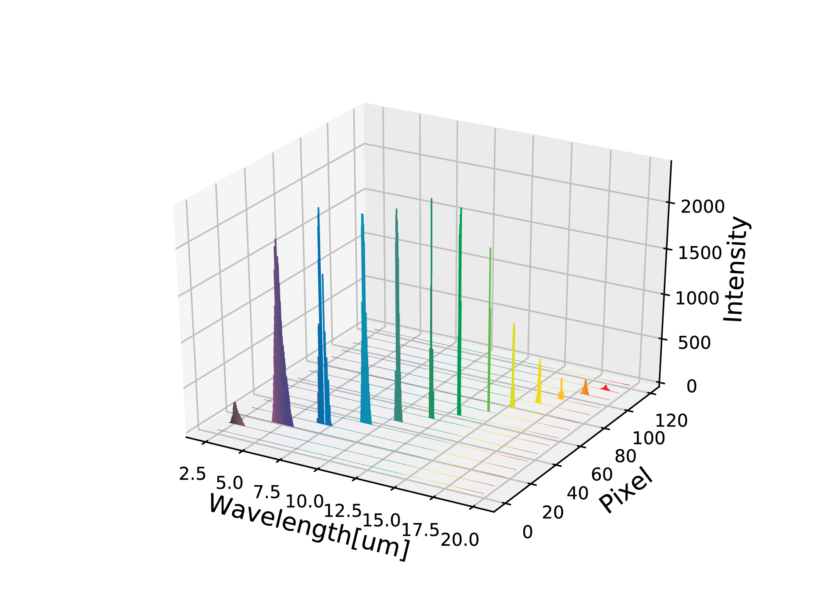

# ludwig_docs
Documentation of ray tracing simulation of transmission line with spectral absorption and simulated detector output. Project made for ELI Beam Lines.
Project written in python 3.5
<figure>
  
  <figcaption>Fig.1 - Geometrical rays propagation through optical line</figcaption>
</figure>

<figure>
  
  <figcaption>Fig.2 - Points of rays intersection with the screen</figcaption>
</figure>

<figure>
  
  <figcaption>Fig.3 - Comparison of input spectrum, transformed by setup and simulated output of detector</figcaption>
</figure>

<figure>
  
  <figcaption>Fig.4 - Spectrum overlapping on detector</figcaption>
</figure>

